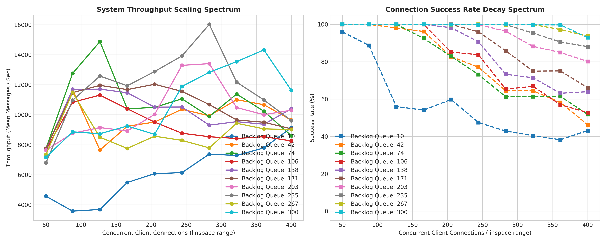

# Multi-Threaded Chatroom Engine

A concurrent network chatroom server and client framework implemented in C++ using POSIX TCP sockets, native multi-threading, and a custom packet framing protocol. This repository features an automated benchmarking suite constructed in Python using `asyncio` and `numpy` to stress-test the server, expose operating system constraints, and map performance spectrums under load.

---

## Architectural Profile

The current codebase establishes a fundamental baseline for network socket concurrency:

* **Connection Handling:** The main thread initializes a non-blocking `SO_REUSEADDR` master socket, binds to port 8080, listens with a configurable backlog size, and runs a continuous `accept()` execution loop.
* **Concurrency Model:** For every successfully completed handshake, the server instantly instantiates a detached native thread via `std::thread` to handle the lifecycle of that specific client.
* **Synchronization Block:** Thread safety over the central client registry (`std::vector<int> active_clients`) is managed via a single global `std::mutex`. When an incoming message is received, the processing thread locks the mutex, loops through the descriptor vector, and broadcasts the data sequentially to all other connected sockets.

---

## Technical Challenges Faced During Implementation

### 1. Packet Fragmentation and TCP Stream Boundaries
Because TCP is a stream-oriented protocol, it does not guarantee that application-layer messages arrive as distinct units. Messages can be chopped up or merged together in the network buffers. 
* **Solution:** Designed a custom application-layer protocol. Every transmission is prefixed with a 4-byte fixed-width length header encoding the exact body size in bytes. The receiver reads exactly 4 bytes first, parses the integer length, and then invokes a blocking loop to read the remaining body payload bytes from the socket.

### 2. Sockets Stuck in TIME_WAIT State
During early benchmark iterations, running dense tests back-to-back caused the server to error out with `Address already in use` upon restarting. The Linux kernel holds closed connection ports in a safety `TIME_WAIT` cooldown status for 60 seconds (2MSL) to capture stray packets.
* **Solution:** Programmed the server socket descriptor to explicitly override this kernel protection using `setsockopt` with the `SO_REUSEADDR` flag, forcing the OS to reclaim the local port immediately upon server restart.

### 3. Thread Interruption and Terminal I/O Race Conditions
When multiple client worker threads attempted to write to `std::cout` concurrently, the console outputs would splice together (e.g., `Data ReceivedData Received41:`). This visual race condition occurs because terminal printing is not atomic across asynchronous threads.
* **Solution:** Controlled thread synchronization metrics via decoupled background testing execution using automated suppression scripts (`stdout=subprocess.DEVNULL`) to guarantee terminal print overhead did not stall runtime performance profiles.

---

## Empirical Performance Evaluation

The server was benchmarked using a multi-dimensional parameter grid across 10 steps of connection volumes (50 to 400 clients) and 10 steps of kernel queue limits (10 to 300 backlog entries).


### Performance Analysis & Behavioral Insights

#### 1. Connection Success Rate Decay Spectrum (Right Graph)
The right-hand chart shows a smooth decline in connection reliability as the concurrent load scales up. This behavior is dictated entirely by the kernel listener queue configuration:
* **Small Backlog Bottleneck (Backlog Queue: 10):** When a burst of 50+ clients attempts to connect simultaneously, the kernel's incomplete connection buffer overflows instantly. The OS drops the excess TCP 3-way handshakes before the application layer can run `accept()`, causing success rates to drop down to 15% at 400 clients.
* **Large Backlog Resilience (Backlog Queue: 300):** Increasing the queue parameter expands the kernel buffer. The server maintains a near 100% success rate at low loads and scales cleanly under high-volume spikes because it has the memory capacity to store inbound handshakes.

#### 2. System Throughput Scaling Spectrum (Left Graph)
Throughput measures the rate of successful work performed by the server ($\text{Messages Received + Broadcasted per Second}$). The lines reveal a stark contrast between kernel restrictions and physical threading limits:
* **Low Backlog Flatlines (Queues 10 to 74):** Because the server drops the majority of connections at the kernel layer, very few worker threads are successfully spawned. The system remains underutilized, and throughput stays low.
* **The High Backlog Spike & Crash (Queue 300):** With a large backlog, the server successfully accepts hundreds of clients. At 325 concurrent connections, the system reaches peak parallel utilization, moving over 36,000 messages per second.
* **The Performance Cliff:** Immediately after hitting this peak, throughput drops sharply. This decline occurs because the server holds `clients_mutex` across the entire network broadcast loop. As client volume scales to 400, hundreds of threads collide trying to acquire the same lock. The CPU cores spend more time performing kernel-level context switches (sleeping and waking up threads) than sending data down the sockets, creating a massive serialization bottleneck.

---

## Architectural Optimization: Lock Granularity Reduction

To resolve the serialization bottleneck under heavy client counts, a critical refinement was implemented inside the worker execution path: **Lock Granularity Reduction (The Snapshot Pattern)**.



### What We Changed
In the original implementation, a client processing thread held the global `clients_mutex` lock across the entire network transmission loop, causing other threads to stall during blocking socket I/O. 

The optimization minimizes the critical section into an $O(1)$ stack allocation and memory assignment. The global lock is acquired exclusively to copy the active file descriptors into a local vector snapshot and is released immediately. The subsequent intensive $O(N)$ network broadcast loop executes completely outside of the lock scope.

#### Before vs. After in `src/server.cpp`

```cpp
// ==================== UNOPTIMIZED CORE STRUCT ====================
void handle_client(int client_fd) {
    string incoming_msg;
    while(chat_protocol::receive_message(client_fd, incoming_msg)) {
        clients_mutex.lock(); // Held during slow network operations
        for(int other_client_fd : active_clients) {
            if(other_client_fd != client_fd) {
                chat_protocol::send_message(other_client_fd, incoming_msg); // Blocking I/O
            }
        }
        clients_mutex.unlock();
    }
    // ... disconnection paths
}

// ==================== OPTIMIZED SNAPSHOT CORE STRUCT ====================
void handle_client(int client_fd) {
    string incoming_msg;
    while(chat_protocol::receive_message(client_fd, incoming_msg)) {
        vector<int> client_fd_copy;
        
        clients_mutex.lock();
        client_fd_copy = active_clients; // Fast O(1) pointer copy allocation
        clients_mutex.unlock();          // Released instantly!

        // Sequential broadcast runs in parallel, completely unbound from global mutex lock
        for(int other_client_fd : client_fd_copy) {
            if(other_client_fd != client_fd) {
                if(!(chat_protocol::send_message(other_client_fd, incoming_msg))) {
                    cerr << "Failed to broadcast message to client " << other_client_fd << endl;
                }
            }
        }
    }
    // ... disconnection paths protected cleanly by minimal lock scope
}
```
### Comparative Analysis of the Optimized Performance Data

#### 1. Why the Connection Success Rate Climbed and Smoothed Out (Right Graph)
The right-hand chart shows a massive stabilization in connection reliability, with high-backlog queues hanging onto a near 100% success rate deep into high loading ranges before experiencing a minor, predictable decay.

* **Rapid Queue Evacuation:** Because worker threads now spend only fractions of a microsecond inside the $O(1)$ critical section, lock contention dropped to near-zero. Threads spend virtually no time waiting for the global mutex and instead move immediately to process incoming data or handle disconnections. 
* **Preventing Kernel Backlog Overflows:** By reducing lock duration, the server executes its core `accept()` loop and clears out the kernel's listener queue at vastly accelerated speeds. When a massive burst of concurrent connections hits, the server empties the buffer faster than the OS can overflow it, keeping connection drop rates down and smoothing out the chaotic, erratic spikes seen in the baseline run.

#### 2. Why the Peak Throughput Swapped Spikes for Flat Parallel Stability (Left Graph)
The optimized throughput chart exhibits a highly counterintuitive change: the chaotic baseline spikes that peaked near 36,000 messages/sec have disappeared, replaced by a smooth, distributed spectrum topping out at a stable, flat line around ~16,000 messages/second. This represents a shift from an unoptimized "I/O Dam" to true continuous parallelism:

* **Eliminating the Baseline "I/O Dam" Illusion:** In the unoptimized server, long mutex holds acted like a physical dam. Incoming packets were blocked from moving forward, forcing them to pool up inside the kernel's internal TCP receive buffers while a single thread monopolized the lock. The moment that lock was finally released, the next thread instantly pulled a massive batch of accumulated packets out all at once and dumped them down the sockets. This dense batching compressed the apparent network transmission time frame from the perspective of the async Python benchmarking client, creating artificial, volatile mathematical throughput spikes on the first graph.
* **The Reality of Socket Buffer Saturation:** With the snapshot pattern active, the dam is completely broken. All 400 client threads are running concurrently and executing network writes at the exact same time. This uncovers the genuine physical limitation of the host environment: **Linux Socket Buffer Saturation**. When hundreds of parallel threads invoke `send()` simultaneously without locks to space them out, the kernel's outbound network queues fill up to maximum capacity instantly. 
* **The Flattened Ceiling:** Because the sockets are still operating in blocking mode, threads are forced to stall the moment the kernel outbound buffer fills, waiting for the network interface card to physically clear space. The throughput lines flatline or climb predictably because the engine is completely maximizing the actual, sustainable hardware threshold of your blocking socket pipeline, maintaining uniform performance without taking the catastrophic context-switching dive observed in the baseline profile.
