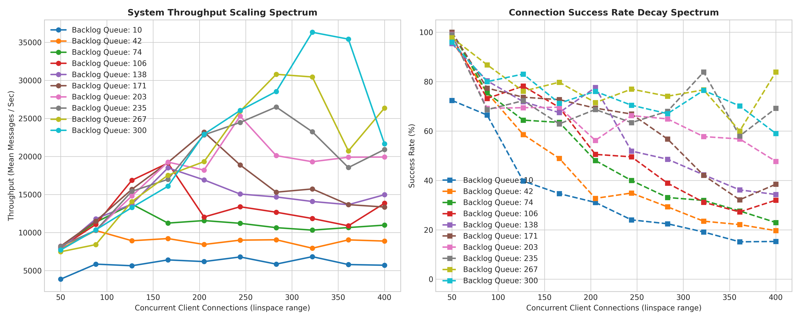

# Multi-Threaded Chatroom Engine

A concurrent network chatroom server and client framework implemented in C++ using POSIX TCP sockets, native multi-threading, and a custom packet framing protocol. This repository features an automated benchmarking suite constructed in Python using `asyncio` and `numpy` to stress-test the server, expose operating system constraints, and map performance spectrums under load.

---

## Architectural Profile

The current codebase establishes a fundamental baseline for network socket concurrency:

* **Connection Handling:** The main thread initializes a non-blocking `SO_REUSEADDR` master socket, binds to port 8080, listens with a configurable backlog size, and runs a continuous `accept()` execution loop.
* **Concurrency Model:** For every successfully completed handshake, the server instantly instantiates a detached native thread via `std::thread` to handle the lifecycle of that specific client.
* **Synchronization Block:** Thread safety over the central client registry (`std::vector<int> active_clients`) is managed via a single global `std::mutex`. When an incoming message is received, the processing thread locks the mutex, loops through the descriptor vector, and broadcasts the data sequentially to all other connected sockets.

---

## Technical Challenges Faced During Implementation

### 1. Packet Fragmentation and TCP Stream Boundaries
Because TCP is a stream-oriented protocol, it does not guarantee that application-layer messages arrive as distinct units. Messages can be chopped up or merged together in the network buffers. 
* **Solution:** Designed a custom application-layer protocol. Every transmission is prefixed with a 4-byte fixed-width length header encoding the exact body size in bytes. The receiver reads exactly 4 bytes first, parses the integer length, and then invokes a blocking loop to read the remaining body payload bytes from the socket.

### 2. Sockets Stuck in TIME_WAIT State
During early benchmark iterations, running dense tests back-to-back caused the server to error out with `Address already in use` upon restarting. The Linux kernel holds closed connection ports in a safety `TIME_WAIT` cooldown status for 60 seconds (2MSL) to capture stray packets.
* **Solution:** Programmed the server socket descriptor to explicitly override this kernel protection using `setsockopt` with the `SO_REUSEADDR` flag, forcing the OS to reclaim the local port immediately upon server restart.

### 3. Thread Interruption and Terminal I/O Race Conditions
When multiple client worker threads attempted to write to `std::cout` concurrently, the console outputs would splice together (e.g., `Data ReceivedData Received41:`). This visual race condition occurs because terminal printing is not atomic across asynchronous threads.
* **Solution:** Controlled thread synchronization metrics via decoupled background testing execution using automated suppression scripts (`stdout=subprocess.DEVNULL`) to guarantee terminal print overhead did not stall runtime performance profiles.

---

## Empirical Performance Evaluation

The server was benchmarked using a multi-dimensional parameter grid across 10 steps of connection volumes (50 to 400 clients) and 10 steps of kernel queue limits (10 to 300 backlog entries).



### Performance Analysis & Behavioral Insights

#### 1. Connection Success Rate Decay Spectrum (Right Graph)
The right-hand chart shows a smooth decline in connection reliability as the concurrent load scales up. This behavior is dictated entirely by the kernel listener queue configuration:
* **Small Backlog Bottleneck (Backlog Queue: 10):** When a burst of 50+ clients attempts to connect simultaneously, the kernel's incomplete connection buffer overflows instantly. The OS drops the excess TCP 3-way handshakes before the application layer can run `accept()`, causing success rates to drop down to 15% at 400 clients.
* **Large Backlog Resilience (Backlog Queue: 300):** Increasing the queue parameter expands the kernel buffer. The server maintains a near 100% success rate at low loads and scales cleanly under high-volume spikes because it has the memory capacity to store inbound handshakes.

#### 2. System Throughput Scaling Spectrum (Left Graph)
Throughput measures the rate of successful work performed by the server ($\text{Messages Received + Broadcasted per Second}$). The lines reveal a stark contrast between kernel restrictions and physical threading limits:
* **Low Backlog Flatlines (Queues 10 to 74):** Because the server drops the majority of connections at the kernel layer, very few worker threads are successfully spawned. The system remains underutilized, and throughput stays low.
* **The High Backlog Spike & Crash (Queue 300):** With a large backlog, the server successfully accepts hundreds of clients. At 325 concurrent connections, the system reaches peak parallel utilization, moving over 36,000 messages per second.
* **The Performance Cliff:** Immediately after hitting this peak, throughput drops sharply. This decline occurs because the server holds `clients_mutex` across the entire network broadcast loop. As client volume scales to 400, hundreds of threads collide trying to acquire the same lock. The CPU cores spend more time performing kernel-level context switches (sleeping and waking up threads) than sending data down the sockets, creating a massive serialization bottleneck.

---

## Directory Structure

```text
chatroom/
├── include/
│   └── protocol.hpp          # Packet framing header (4-byte ASCII length prefix)
├── src/
│   ├── client.cpp            # Interactive C++ terminal chat client
│   └── server.cpp            # Multi-threaded server engine with global lock synchronization
├── tests/
│   ├── stress_test_raw_sockets.py # NumPy-driven automated matrix test suite
│   ├── benchmark_results.csv # Compiled raw metrics dataset from test runs
│   └── charts_raw_sockets.png# Visualized baseline spectrum of performance metrics
└── Makefile                  # Build system configuration
